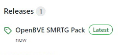
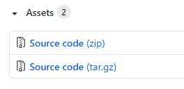

# OpenBVE Routes and Trains

```
Contains the OpenBVE Routes and Trains that was modified from the
original by SMRTG Studios. Recommended OpenBVE Version: 1.7.0.3
```
### Quick Navigation
[What's Inside?](#Whats-Inside)

[How To Download?](#How-to-download)


## What's Inside?
```
- Railway (Route)
  - Airport Express Line (TrainVision Compatible*)
  - Changi Airport Line (TrainVision/STARiS 2 Compatible*)
  - Harbourvale Line (TrainVision/STARiS 2 Compatible*)
  - Yishun LRT (STARiS 2 Compatible*)

- Train
  - Refurbished C651
  - SMRTG C651A
  - SMRTG C651B
  - YL150/A/B

* Note:
STARiS 2 is available for: Changi Airport Line, Harbourvale Line, Yishun LRT
TrainVision is available for: Airport Express Line, Changi Airport Line, Harbourvale Line

Package Size: 921MB (approximately)
```


### How to Download?
```
Step 1:
Locate the Releases section on the right side. Click on it.
```


```
Step 2:
Select the Source Code (Zip) section. Click to Download.
```


